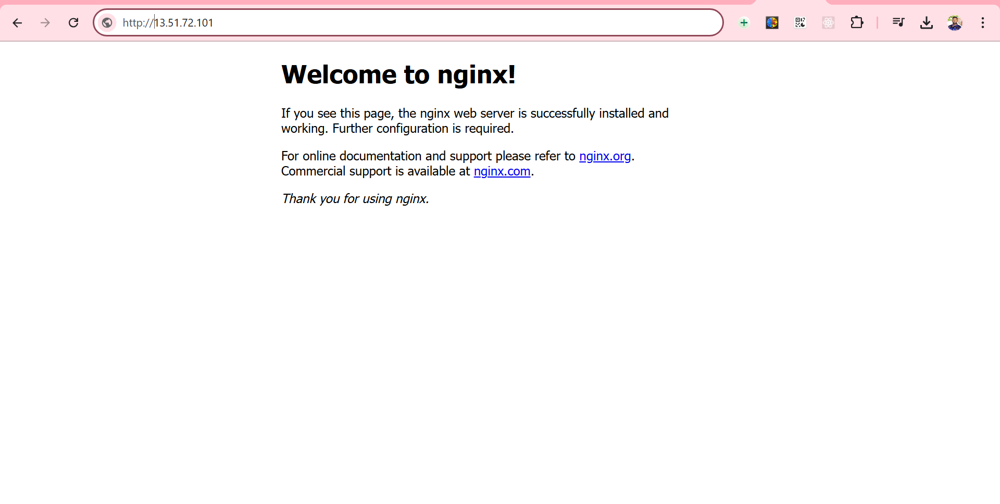

# Task 3: Cloud Infrastructure Deployment (AWS)

## Objective:
Deploy a virtual machine instance on AWS with the following configurations:
- Linux-based OS
- SSH access
- Web server (Nginx) setup
- Firewall rules for HTTP traffic
- Static IP address

---

### Step 1: Create a Virtual Machine (EC2 Instance)

1. **Action**: Launch an EC2 instance with Ubuntu (or your preferred Linux distribution).
   - Go to the AWS EC2 dashboard.
   - Click **Launch Instance**.
   - Choose an AMI (Amazon Machine Image), for example, **Ubuntu Server 20.04 LTS**.
   - Select an instance type (e.g., `t2.micro` for testing purposes).
   - Configure the instance (leave default settings for now).
   - Add a security group (or configure existing) to allow SSH and HTTP (ports 22 and 80).
   - Review and launch the instance.

2. **Screenshot**:
   .PNG)
   *The screenshot shows the EC2 instance setup page with selected configurations.*

---

### Step 2: Set Up SSH Access

1. **Action**: Connect to your instance via SSH.
   - Retrieve the public IP address of your EC2 instance from the EC2 dashboard.
   - Use your SSH key to connect:
   ```bash
   ssh -i your-key.pem ubuntu@<your-ec2-public-ip>
- If successful, you should be logged into your EC2 instance.

2. **Screenshot**:
   
   
   *The screenshot shows the successful SSH connection to the EC2 instance.*

---

### Step 3: Install Nginx Web Server

1. **Action**: Update your system and install Nginx.
   - First, update your system to ensure all packages are up to date:
     ```bash
     sudo apt update && sudo apt upgrade -y
     ```
   - Install the Nginx web server:
     ```bash
     sudo apt install nginx -y
     ```

2. **Screenshot**:
   _Installation.PNG)
   *The screenshot shows the terminal after Nginx installation is complete.*

---

### Step 4: Start and Enable Nginx

1. **Action**: Start Nginx and enable it to start on boot.
   - Use the following commands to start and enable Nginx:
     ```bash
     sudo systemctl start nginx
     sudo systemctl enable nginx
     ```

2. **Screenshot**:
   _Installation.PNG)
   *The screenshot shows the status of Nginx after starting it.*

---

### Step 5: Verify Nginx Installation

1. **Action**: Verify that Nginx is working correctly by visiting the public IP of your EC2 instance in a browser:
   - Open your browser and type the public IP address of your EC2 instance in the address bar: `http://<your-ec2-public-ip>`
   - You should see the default Nginx welcome page, which confirms the successful installation of Nginx.

2. **Screenshot**:
   
   *The screenshot shows the default Nginx welcome page displayed in the browser.*

---

### Step 6: Set Up Firewall Rules for HTTP Traffic

1. **Action**: Configure security group to allow HTTP traffic on port 80.
   - In the AWS EC2 Console, go to **Security Groups**.
   - Select the security group associated with your EC2 instance.
   - Add a new inbound rule:
     - Type: **HTTP**
     - Port Range: **80**
     - Source: **Anywhere (0.0.0.0/0)**

2. **Screenshot**:
   
   *The screenshot shows the security group settings with HTTP access enabled.*

---

### Step 7: Assign a Static IP (Elastic IP)

1. **Action**: Allocate and associate an Elastic IP with your EC2 instance.
   - In the AWS EC2 Dashboard, go to **Elastic IPs**.
   - Click **Allocate Elastic IP** and confirm the allocation.
   - Once the IP is allocated, select **Associate Elastic IP** and choose your running EC2 instance.

2. **Screenshot**:
   
   *The screenshot shows the Elastic IP association process for the EC2 instance.*

---

### Step 8: Verify HTTP Access via Static IP

1. **Action**: Test the HTTP access using the Elastic IP.
   - In your browser, go to `http://<elastic-ip>`.
   - You should see the default Nginx page confirming the web server is running.

2. **Screenshot**:
   
   *The screenshot shows the browser accessing the EC2 instance through the Elastic IP.*

---

